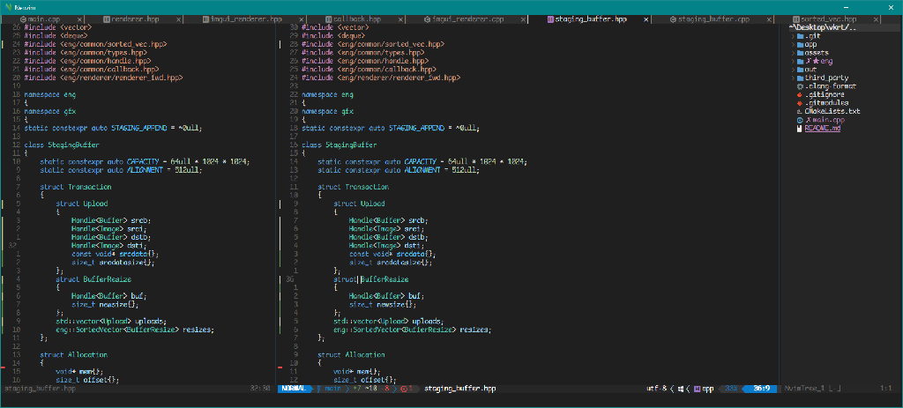

# Nvim setup for c++ development with CMake and Clang.

No debugging. I do it with Visual Studio. Works with empty cmake file, and completion is working even without it, so good for PoF and as a scratchpad. \
Use with nvim-qt.
NerdFont: [https://github.com/xtevenx/ComicMonoNF](https://github.com/xtevenx/ComicMonoNF)
